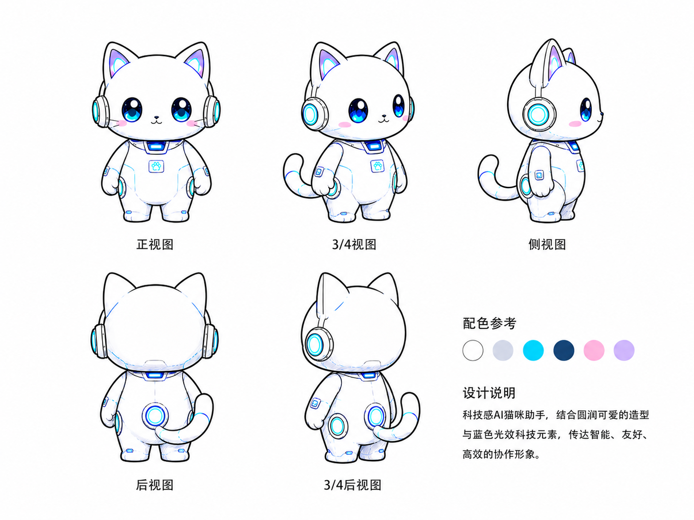

# Codeartz Illustrations

> 把中文文章里的判断、流程、状态和隐喻，变成一张张白底、手绘、有 AI 猫 IP 的正文配图。
>
> 16:9 横版 | Codeartz AI 猫 IP | 白底手绘 | 蓝青科技光效 | 粉紫可爱点缀 | Codex Skill

---

## 这个仓库是什么

Codeartz Illustrations 是一个 Codex Skill，用来指导 AI Agent 为中文文章、帖子、博客、Notion 文档和方法论内容生成正文配图。

它不是通用插画 prompt，也不是 PPT 信息图模板。核心目标是：先理解文章里的认知锚点，再把其中一个判断、流程、结构、状态或隐喻，变成一张有记忆点的 16:9 手绘解释图。

默认视觉 IP 是 **Codeartz AI 猫**：白色主体、蓝青色科技光效、粉紫可爱点缀的 AI/机器人猫咪助手。它必须参与画面的核心动作，不能只是站在角落当装饰。

一句话：**让 AI 不只是“配一张图”，而是把文章里的一个关键认知动作画出来。**

---

## IP 设定图



角色配色逻辑：

| 色块 | 用途 |
| --- | --- |
| 白色 | 主体毛色 / 机身底色 |
| 浅灰蓝 | 阴影、结构转折、耳机金属浅面 |
| 亮青蓝 | 发光件、耳机光圈、尾巴环、胸口屏幕 |
| 深蓝 | 眼睛暗部、耳机深色结构、科技感强调 |
| 粉色 | 腮红、可爱感点缀 |
| 淡紫色 | 耳朵内侧渐变、眼睛高光辅助色 |

整体方向：**白色主体 + 蓝青色科技光效 + 粉紫可爱点缀**。角色要像 AI/机器人助手，同时保持猫咪的柔软可爱感。

---

## 适合谁用

特别适合：

- 写中文文章，需要正文配图和文章插图的人
- 做知识型内容、方法论内容、AI 工作流内容的人
- 想把抽象判断画成具体隐喻的人
- 想要一套稳定、有个人识别度、带科技猫 IP 的配图风格的人
- 用 Codex 做内容生产，希望复用同一套视觉语言的人

不适合：

- 想要商业海报、品牌 KV 或精致扁平插画的人
- 想要传统 PPT 信息图、复杂架构图或流程图的人
- 想把大量正文、长段解释或完整课程页塞进一张图里的人
- 需要严格可编辑矢量源文件的人

---

## 它会产出什么

默认输出：

- 16:9 横版正文配图
- 一篇文章的 4-8 张 shot list
- 每张图的主题、核心意思、结构类型、AI 猫动作和中文标注建议
- 最终 PNG 图片，保存到 workspace 的 `assets/<article-slug>-illustrations/`

默认不输出：

- PPTX / PDF / Keynote
- SVG / HTML / Canvas 可编辑图
- 商业海报或封面 KV
- 大段文字型信息图

---

## 视觉风格

这个 skill 默认使用 Codeartz AI 猫正文配图风格：

- 纯白背景，不要纸纹、米色、阴影、渐变
- 黑色手绘轮廓线，细线，轻微抖动
- 大量留白，主体只占画面约 40%-60%
- 白色猫咪主体，浅灰蓝结构阴影
- 亮青蓝用于发光件、路径、反馈状态和科技强调
- 深蓝用于眼睛、耳机深色结构和少量文字强调
- 粉色和淡紫色只做腮红、耳朵内侧、高光和温柔点缀
- 一张图只表达一个核心动作、结构、状态或隐喻
- AI 猫必须参与核心动作，不能只是装饰
- 可爱但不幼稚，科技但不硬核，清爽但有记忆点

---

## 安装

克隆仓库：

```bash
git clone https://github.com/hanjeahwan/codeartz-illustrations.git
cd codeartz-illustrations
```

复制 skill 到 Codex skills 目录：

```bash
mkdir -p "${CODEX_HOME:-$HOME/.codex}/skills"
cp -R ./codeartz-illustrations "${CODEX_HOME:-$HOME/.codex}/skills/"
```

安装后，在 Codex 里使用：

```text
Use $codeartz-illustrations 为这篇中文文章设计并生成 5 张 AI 猫正文配图。
```

---

## 怎么用

### 只做配图规划

```text
Use $codeartz-illustrations 先不要生图。
请分析下面这篇文章哪里值得配图，输出 5 张左右的 shot list。
每张图写清楚：放在哪段后、主题、核心意思、结构类型、AI 猫在做什么、建议中文标注词。

<粘贴文章>
```

### 直接生成正文配图

```text
Use $codeartz-illustrations 把下面这篇文章生成 4 张 AI 猫正文配图。
要求：16:9 横版、纯白背景、黑色手绘轮廓、白色 AI 猫主体、蓝青色科技光效、粉紫可爱点缀。

<粘贴文章>
```

### 为单个概念生成一张图

```text
Use $codeartz-illustrations 为“信任不是喊出来的，而是一块证据一块证据铺过去”生成一张正文配图。
画面要清爽、有点奇怪但成立，AI 猫必须承担核心动作。
```

### 去掉图里的标题或错误文字

```text
Use $codeartz-illustrations 帮我编辑这张图，去掉左上角的“流程图”标题，其他内容保持不变。
```

更多示例见 [examples/prompts.md](examples/prompts.md)。

---

## 工作流程

1. 读取文章、Markdown、Notion 内容、截图或用户给的主题
2. 提炼核心观点、认知转折、流程结构和适合视觉化的段落
3. 先输出 shot list：每张图只选一个认知锚点
4. 为每张图选择结构类型：Workflow、系统局部、前后对比、角色状态、概念隐喻、方法分层、地图路线或小漫画分镜
5. 重新发明一个低科技或轻科技、奇怪但成立的物理隐喻
6. 让 AI 猫承担核心动作
7. 每张图单独调用图像模型生成
8. 按 QA checklist 检查：白底、留白、AI 猫动作、配色、中文标注、非 PPT 感、非旧案例复刻
9. 保存最终 PNG，并报告用途和路径

---

## 目录结构

```text
.
├── README.md
├── LICENSE
├── NOTICE.md
├── examples/
│   └── prompts.md
└── codeartz-illustrations/
    ├── SKILL.md
    ├── agents/
    │   └── openai.yaml
    ├── assets/
    │   └── ip/
    │       └── codeartz-ai-cat-reference.png
    └── references/
        ├── style-dna.md
        ├── ai-cat-ip.md
        ├── composition-patterns.md
        ├── prompt-template.md
        └── qa-checklist.md
```

真正需要安装到 Codex 的是子目录：

```text
codeartz-illustrations/
```

---

## 注意事项

- 图片里的中文文字越短越稳定。
- 每张图只讲一个核心结构，不要把文章做成说明书。
- AI 猫必须承担核心动作；如果去掉 AI 猫画面仍然完全成立，说明角色太装饰了。
- 旧角色示例图已移除；新 IP 以 `codeartz-illustrations/assets/ip/codeartz-ai-cat-reference.png` 为准。
- AI 图像模型可能出现错字、幻觉标签、风格漂移或多余标题，生成后需要检查。
- 如果中文错字严重，优先减少标注词并重生成。
